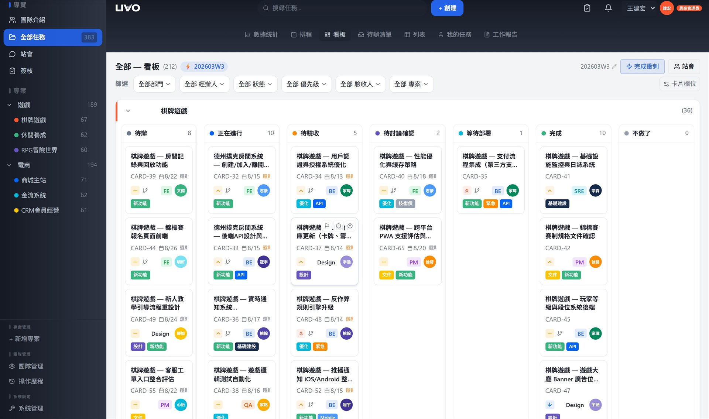
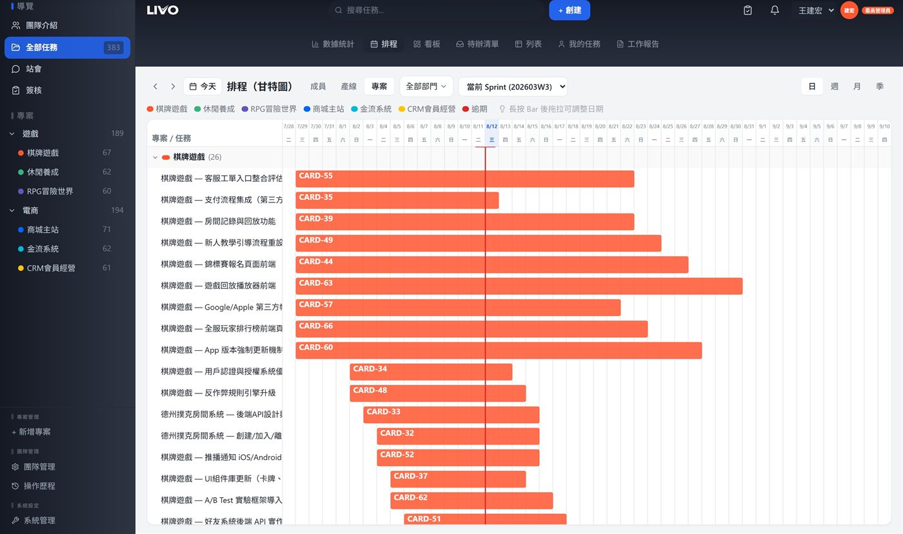
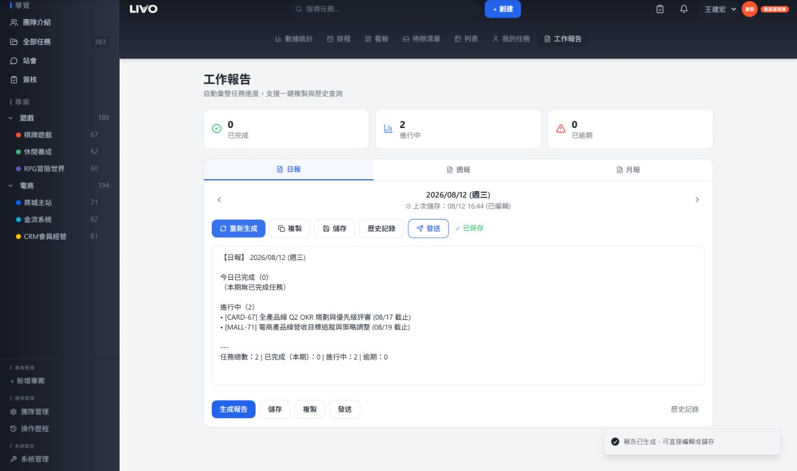
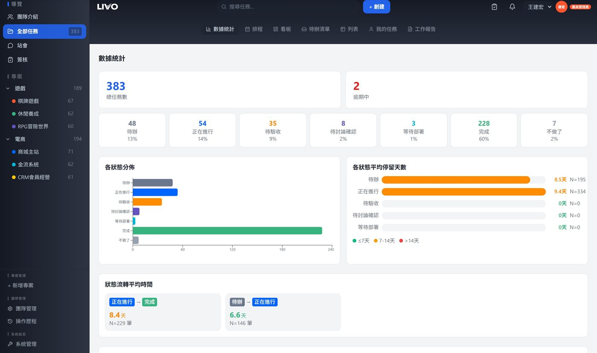
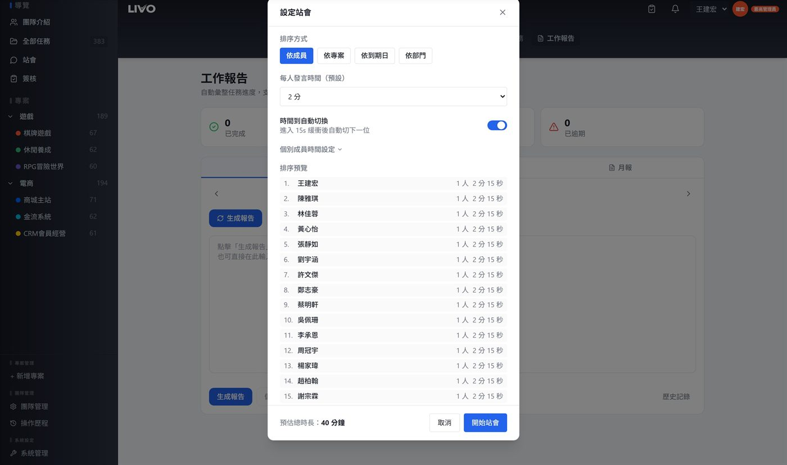

# LIVO

給中文團隊用的專案管理系統：看板、甘特圖、Sprint、自動整理的日報週報、站會、簽核流程都在裡面。可以架在自己的機器上（Docker，內網也能跑），也可以部署到 Cloudflare。以 [AGPL-3.0](LICENSE) 開源。

[English](README.en.md) · [線上試玩](https://livo-tw.com/demo/?demo=pro) · [官網](https://livo-tw.com)

[](https://github.com/livo-tw/livo/actions/workflows/ci.yml)
[](LICENSE)



線上試玩不用註冊，資料只存在你的瀏覽器分頁裡，關掉就消失。

## 功能

- **看任務的方式**：看板、列表、待辦清單、甘特圖（可設任務依賴）、我的任務
- **Sprint**：衝刺規劃與完成衝刺，開新衝刺時可以把沒做完的任務一起帶過去
- **工作報告**：依任務狀態整理出日報、週報、月報，可以手動編修、存歷史，也能排程發到 Slack
- **站會模式**、**簽核流程**、**儀表板**
- **任務細節**：子任務、任務依賴、自訂欄位、必填欄位、任務範本、狀態流轉規則、工時紀錄
- **多人協作**：畫面即時同步；兩個人同時改同一個欄位時會提示並鎖定
- **通知與整合**：站內通知、Email（Resend）、Slack、Webhooks、個人 API Token
- **管理**：成員與角色權限、操作歷程、JSON 備份與匯出、Jira CSV 匯入
- **介面**：繁體中文、簡體中文、English，深色／淺色主題，`Ctrl/Cmd + K` 快速搜尋

| 甘特圖 | 工作報告 |
| --- | --- |
|  |  |
| **儀表板** | **站會** |
|  |  |

## 開始使用

有三種方式，挑一種就好。

### 1. 在自己電腦上跑起來（開發模式）

需要 Node.js 22 以上。後端用 Cloudflare 的 `wrangler dev` 在本機模擬資料庫與檔案儲存，不需要 Cloudflare 帳號。

```bash
git clone https://github.com/livo-tw/livo.git livo
cd livo
npm ci

# 後端
cd worker
npm ci
cp .dev.vars.example .dev.vars      # 把 JWT_SECRET 改成一串夠長的隨機字
npm run db:migrate:local            # 建立本機資料庫
npm run db:seed:local               # 示範資料：20 位虛構成員，密碼都是 test1234
npm run dev                         # API 跑在 http://localhost:8787

# 前端（另開一個終端機，回到 repo 根目錄）
cp .env.example .env.development
npm run dev                         # 打開 http://localhost:5173/demo/
```

用 `admin@livo.test` / `test1234` 登入。不想要示範資料的話，把 `npm run db:seed:local` 換成下面這行，會建立空白的系統和你自己的管理員帳號（密碼只顯示一次）：

```bash
node scripts/init-instance.mjs --local --email you@example.com --name 你的名字
```

### 2. Docker 自架（資料完全留在自己的機器）

適合放在公司內網或自己的伺服器。需要 Docker（含 Compose），打包安裝包的那台電腦需要 Node.js 22 以上。

```bash
git clone https://github.com/livo-tw/livo.git livo
cd livo
npm ci
node scripts/build-release.mjs      # 產生 release/livo-release/（Linux/macOS 需要 zip 指令）

cd release/livo-release
sh install.sh                       # Windows：對 install.bat 點兩下
```

安裝程式會為這套安裝產生專屬的金鑰與密碼、匯入資料庫結構，再請你建立第一位管理員。完成後打開 <http://localhost:3000/demo/>。詳細說明、日常維運與疑難排解在 [release-template/README.md](release-template/README.md)。

### 3. 部署到 Cloudflare

後端用 Workers + D1 + R2 + Durable Objects，前端用 Pages。先在 `worker/` 登入：`npx wrangler login`。

```bash
cd worker
npx wrangler d1 create livo-db              # 把印出的 database_id 貼進 wrangler.jsonc
npx wrangler r2 bucket create livo-attachments
npx wrangler secret put JWT_SECRET          # 貼上一串夠長的隨機字
npm run db:migrate:remote
node scripts/init-instance.mjs --remote --email you@example.com --name 你的名字
npx wrangler deploy                         # 記下 API 網址，例如 https://livo-api.<帳號>.workers.dev

cd ..
VITE_API_URL=https://livo-api.<帳號>.workers.dev VITE_LOCAL_MODE=false npx vite build --outDir dist
mkdir -p site/demo && cp -r dist/* site/demo/
printf '/demo/*  /demo/index.html  200\n' > site/_redirects
npx wrangler pages deploy site --project-name livo
```

最後把前端網址（例如 `https://livo.pages.dev`）加進 `worker/wrangler.jsonc` 的 `ALLOWED_ORIGINS`，並設好 `APP_BASE_URL`、`API_BASE_URL`，再跑一次 `npx wrangler deploy`。要寄 Email 通知就再設定 `RESEND_API_KEY`（說明在 `wrangler.jsonc` 最後）。

## 技術架構

| | |
| --- | --- |
| 前端 | React 18、TypeScript、Vite、Tailwind CSS（shadcn/ui）、TipTap 編輯器 |
| 後端（Cloudflare） | Workers（Hono）、D1（SQLite）、Durable Objects（即時同步）、R2（附件） |
| 後端（Docker） | 自架 Supabase：Postgres、PostgREST、Realtime、Edge Functions |
| 登入 | 自建 JWT（access 1 小時、refresh 30 天並輪替），密碼用 PBKDF2 |

```
src/                    前端
worker/                 Cloudflare Worker 後端（schema.sql、seed.sql、設計說明 DESIGN.md）
docker/                 Docker 自架版（Supabase 設定與 edge functions）
supabase/migrations/    Docker 版的資料庫結構
release-template/       Docker 安裝程式與部署說明
scripts/build-release.mjs  產生 Docker 安裝包
```

## 目前的限制

- 網址固定在 `/demo/` 路徑下（例如 `http://localhost:3000/demo/`）。
- Jira 匯入目前只認得「簡體中文介面」匯出的 CSV 欄位名稱。
- 介面文字以繁體中文最完整，簡中和英文有部分畫面還沒翻譯。

## 授權

LIVO 以 [GNU AGPL-3.0](LICENSE) 釋出。你可以免費使用、修改、商用。如果你修改了程式，再透過網路提供給其他人使用，就要把修改後的原始碼提供給那些使用者。自己公司內部架來用、沒有改程式碼，不需要做任何事。

需要 AGPL 以外的授權條款（商業授權），或需要付費的導入服務（代部署、Jira 搬遷、教育訓練、年度支援），價格與聯絡方式在 <https://livo-tw.com/pricing>，也可以來信 service@livo-tw.com。

## 參與開發

歡迎開 issue 或送 PR，請先看 [CONTRIBUTING.md](CONTRIBUTING.md)。第一次送 PR 需要簽署 [CLA](CLA.md)。安全性問題請依 [SECURITY.md](SECURITY.md) 私下回報，不要開公開 issue。

## 作者

Lingye，台灣的個人開發者，做了十年 PM。LIVO 一開始是做給自己團隊用的工具。
